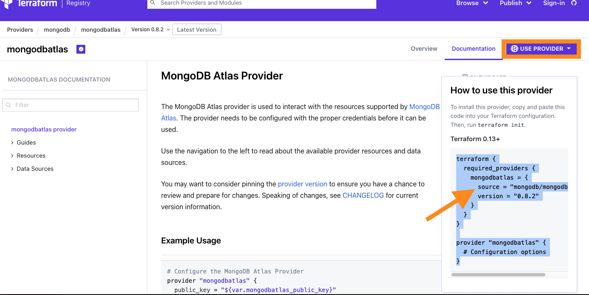
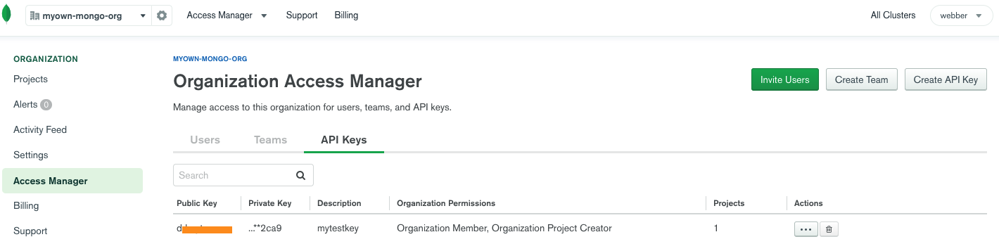
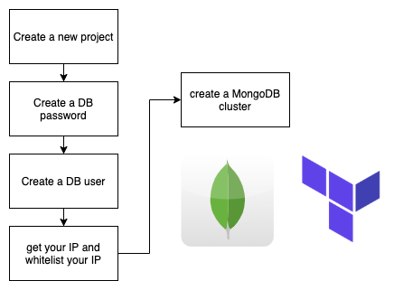

# Deploying a MongoDB Atlas on GCP using Terraform

### What is MongoDB Atlas?
MongoDB Atlas is a Cloud-hosted MongoDB service on AWS, Azure and Google Cloud. Deploy, operate, and scale a MongoDB database in just a few clicks.  Or, you can use **Terraform**.

### Why do we choose to use Terraform? 

The reason is simple.  
* Automate your pipeline end-to-end
* Ensure auditability by tracking all applies
* Establish controls for who can apply changes

### What do we need to create MongoDB via terraform?

* terraform ready on your local machine
* MongoDB atlas account API keys ready

### What Terraform commands you need to use?

Main commands:

__init__          Prepare your working directory for other commands

__validate__      Check whether the configuration is valid

__plan__          Show changes required by the current configuration

__apply__         Create or update infrastructure

__destroy__       Destroy previously-created infrastructure

```
$ terraform init
$ terraform plan 
$ terraform apply 
$ terraform destroy

For more, 
$ terraform -help

```
### Quick Start
You can follow below steps to launch a mongodb atlas cluster quickly. 

1. ensure your github/mongodb atlas accounts ready
2. generate mongodb atlas api keys (public and private key)
3. git clone this repository to your local
4. edit terraform.tfvars 
5. `$ terraform init`
6. `$ terraform plan`
7. `$ terraform apply`

If you would like to gather more terraform logs, you should declare this environment variable.

`$  TF_LOG=TRACE`

If you would like to destroy the mongodb cluster, you should type below

`$ terraform destroy`


### Understand each file

1. edit terraform provider information in provider.tf.  

> source =  "mongodb/mongodbatlas"

I noticed that the source information must be filled in, otherwise terraform cannot find the mongodbatlas provider successfully. 

>provider "mongodbatlas" {

>  public_key  = var.atlas_public_key

>  private_key = var.atlas_private_key

>}

In provider "mongodbatlas" block, I defined 2 variables - atlas_public_key and atlas_private_key for access MongoDB Atlas API. how to generate this 2 keys? please check this link - https://docs.atlas.mongodb.com/configure-api-access/


```
# Define Terraform provider
terraform {
  required_version = ">= 0.12"
  required_providers {
    mongodbatlas = {
      source = "mongodb/mongodbatlas"
      version = "0.8.2"
    }
  }
}

# Define the MongoDB Atlas Provider

provider "mongodbatlas" {
  public_key  = var.atlas_public_key
  private_key = var.atlas_private_key
}

```


2. edit provider-variables.tf

You have to go to your mongodb atlas console to generate a API key, then you have to store private key locally for later use.



```
variable "atlas_public_key" {
  type        = string
  description = "MongoDB Atlas Public Key"
}

variable "atlas_private_key" {
  type        = string
  description = "MongoDB Atlas Private Key"
}
```
3. edit your atlas.tf

There are 5 blocks you have to edit to create a MongoDB cluster.


```

# Create a Project
resource "mongodbatlas_project" "atlas-project" {
  org_id = var.atlas_org_id
  name = var.atlas_project_name
}

# Create a Database Password
resource "random_password" "db-user-password" {
  length = 16
  special = true
  override_special = "_%@"
}

# Create a Database User
resource "mongodbatlas_database_user" "db-user" {
  username = var.db_username
  password = random_password.db-user-password.result
  project_id = mongodbatlas_project.atlas-project.id
  auth_database_name = "admin"

  roles {
    role_name     = "read"
    database_name = "${var.atlas_project_name}-${var.environment}-db"
  }
}

# Get My IP Address and whitelist my current IP address

data "http" "myip" {
  url = "http://ident.me"
}

resource "mongodbatlas_project_ip_whitelist" "project-whitelist-myip" {
  project_id = mongodbatlas_project.atlas-project.id
  ip_address = chomp(data.http.myip.body)
  comment    = "IP Address for my home office"
}

# If you have other CIDR also need to access mongodb atlas, you have to whitelist them

resource "mongodbatlas_project_ip_whitelist" "atlas-whitelist-cidr" {
  for_each = toset(var.whitelist_list_cidr)

  project_id = mongodbatlas_project.atlas-project.id
  cidr_block = each.key
}

# Create a MongoDB Atlas Cluster
resource "mongodbatlas_cluster" "atlas-cluster" {
  project_id = mongodbatlas_project.atlas-project.id
  name       = "${var.atlas_project_name}-${var.environment}-cluster"
  num_shards = 1
  
  replication_factor           = 3
  provider_backup_enabled      = true
  auto_scaling_disk_gb_enabled = true
  mongo_db_major_version       = var.db_version  
  
  provider_name               = "GCP"
  disk_size_gb                = 10
  provider_instance_size_name = var.cluster_instance_size_name
  provider_region_name        = var.atlas_region
}

```
4. edit atlas-variables.tf

>variable "whitelist_list_cidr" {

>  type        = list(string)

>  description = "CIDR to whitelist access to the project"

>}

You can see cidr is a list of string, and that's why we foreach each cidr block.

```
# Atlas Organization ID 
variable "atlas_org_id" {
  type        = string
  description = "Atlas organization id"
}

# Atlas Project name
variable "atlas_project_name" {
  type        = string
  description = "Atlas project name"
}

# Atlas Project environment
variable "environment" {
  type        = string
  description = "The environment to be built"
}

# Cluster instance size name 
variable "cluster_instance_size_name" {
  type        = string
  description = "Cluster instance size name"
  default     = "M10"
}

# Atlas region
variable "atlas_region" {
  type        = string
  description = "GCP region where resources will be created"
  default     = "ASIA_EAST_1"
}

# MongoDB Atlas DB version
variable "db_version" {
  type        = string
  description = "mongodb database version. 4.4"
  default     = "4.4"
}

# MongoDB Atlas DB username
variable "db_username" {
  type        = string
  description = "mongodb database username"
  default     = "demo-read"
}

# CIDR whitelist
variable "whitelist_list_cidr" {
  type        = list(string)
  description = "CIDR to whitelist access to the project"
}

```
5. edit terraform.tfvars

You have to assign values for required variables.
* atlas_public_key
* atlas_private_key
* atlas_org_id
* atlas_project_name

```
# Values for Variables

# MongoDB access and authentication 
atlas_public_key  = "YOUR PUBLIC KEY"
atlas_private_key = "YOUR-PRIVATE-KEY"

# MongoDB Atlas Cluster related settings
atlas_org_id = "YOUR-OGR-ID"
atlas_region = "YOUR-PREFERRED-REGION"
atlas_project_name = "YOUR-PROJECT-NAME"
environment = "DEMO"
db_version = "4.4"
db_username = "demo-read"
cluster_instance_size_name = "M10"
whitelist_list_cidr = ["120.33.233.22/32"]

```


### reference
* Terraform mongodbatlas provider - https://registry.terraform.io/providers/mongodb/mongodbatlas/latest/docs
* Generate MongoDB Atlas API Keys - https://docs.atlas.mongodb.com/configure-api-access/
* AWS and Atlas PrivateLink with Terraform - https://github.com/nikhil-mongo/aws-atlas-privatelink

* Deploy MongoDB on GCP - https://gmusumeci.medium.com/how-to-deploy-mongodb-atlas-on-gcp-using-terraform-3c88127c00d0

* MongoDB Atlas Cluster - https://registry.terraform.io/providers/mongodb/mongodbatlas/latest/docs/resources/cluster

* MongoDB Atlas Cluster on GCP github - https://github.com/guillermo-musumeci/terraform-mongodb-atlas-gcp

